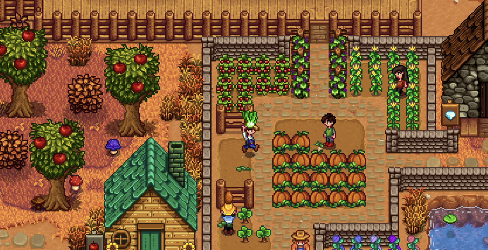
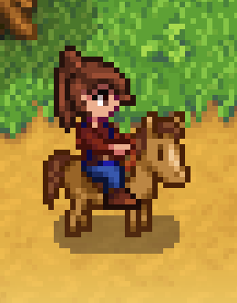

# IDEA9103_tut04_Group_G_Betty_Individual

## Intruduction:
- All the movements in this canvas hve been frame-skipped.
- Move the mouse over the canvas.
- When the mouse is touching a wheel, the wheel starts to rotate, the ellipses inside the wheel and beads around the wheel become squares.
- When the mouse leaves the wheel, the wheel graduatly stop rotating and all squares turn back to ellipses.

## Details:
- I choose Time-Based.
- My animation is related with mouse monitoring and with a pixel style. 
- I got inspiration from pixel game like Stardew Valley. However, turning all shapes into pixel style would change too many group codes. The main style would also change. So, I only changed the easiest shape, ellipse. For example, the elliptical solid rings, elliptical dot rings and elliptical beads. In order to make the pixel style better, I also made all the animations to be frame-skipped. For example, the rotaion of wheels, the movement of connectors and beads.

